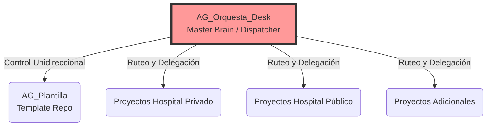

# MASTER PLAN ARQUITECTÓNICO: ANTIGRAVITY OS
**Versión Final Post-Consenso (Round 5)**

## 1. Declaración de Identidad: El Orquestador Aislado
Basado en las auditorías de código, escaneos de seguridad y el mandato absoluto del usuario, se declara que `AG_Orquesta_Desk` DEBE operar como un **"Cerebro Maestro Vacío"**. No debe contener código de aplicación, ni compartir historial Git con las plantillas de las que se originó.

## 2. Plan de Normalización Crítica (4 Pasos de Acción Inmediata)

### Paso A: Exorcismo del Repositorio Git (Riesgo Catastrófico)
Actualmente `AG_Orquesta_Desk` posee una carpeta `.git` heredada que rastrea ~7,200 eliminaciones de la plantilla original.
- [x] **Acción:** Destruir la carpeta `.git` actual.
- [x] **Acción:** Ejecutar `git init` limpio.
- [x] **Contrato de Directorio:** Solo se permiten subdirectorios funcionales al orquestador: `docs/`, `scripts/`, `config/`, `.vscode/`, `.gemini/`, `.subagents/`.

### Paso B: Sellado de Seguridad (Hardening)
Las auditorías demostraron que el ecosistema subyacente (ej. `AG_Consultas`) tiene credenciales expuestas en texto plano. El orquestador actual es ignorante a esto debido a bypasses permisivos.
- [~] **Acción:** Eliminar los flags `--no-verify` de todos los scripts orquestadores (`propagate.py`, `audit_ecosystem.py`, etc.). *(Skipped: El usuario vetó explícitamente esta acción para no romper automatizaciones).*
- [~] **Acción:** Eliminar el flag `--dangerously-skip-permissions` del Dispatcher. Si un Agente necesita modificar un archivo bloqueado o sensible, debe escalar la petición al usuario (Fail-Fast), no sobreescribirla por la fuerza bruta. *(Skipped: Se mantiene automatización).*

### Paso C: Erradicación de la "Sordera" de los Satélites (Discovery)
11 de los 12 proyectos no tienen `TASKS.md` ni bloque de `tasks_awareness` en su `GEMINI.md`. Cuando el Orquestador les manda un agente, el agente aterriza ciego.
- [x] **Acción:** Modificar el router maestro (`cross_task.py` o `propagate.py`) para que inyecte obligatoriamente un `TASKS.md` y un `GEMINI.md` funcional en cada ruta registrada en el `project_registry.json`.

### Paso D: Tolerancia Cero en la Resolución de Entorno
Actualmente `env_resolver.py` omite silenciosamente rutas no encontradas. Esto causa que auditorías reporten 100% de éxito aunque la mitad del ecosistema esté apagado.
- [x] **Acción:** Modificar `env_resolver.py` para que lance un error fatal (`exit 1`) Inmediato si el disco (EJ: Disco `w:\`) o una ruta de proyecto referenciada en el registry no está disponible.

## 3. Topología del Sistema Resultante

## Conclusión
La visión original del usuario de desacoplar los "Agentes" de "Mi Idea" es la única arquitectura escalable. El Orquestador (`AG_Orquesta`) envía a los Agentes (Gemini, Claude, Codex) a las locaciones físicas (`AG_Plantilla`, `AG_Consultas`), pero el Orquestador nunca debe ensuciarse con la implementación, sólo debe leer reportes y disparar scripts.

**FINALIZADO**
